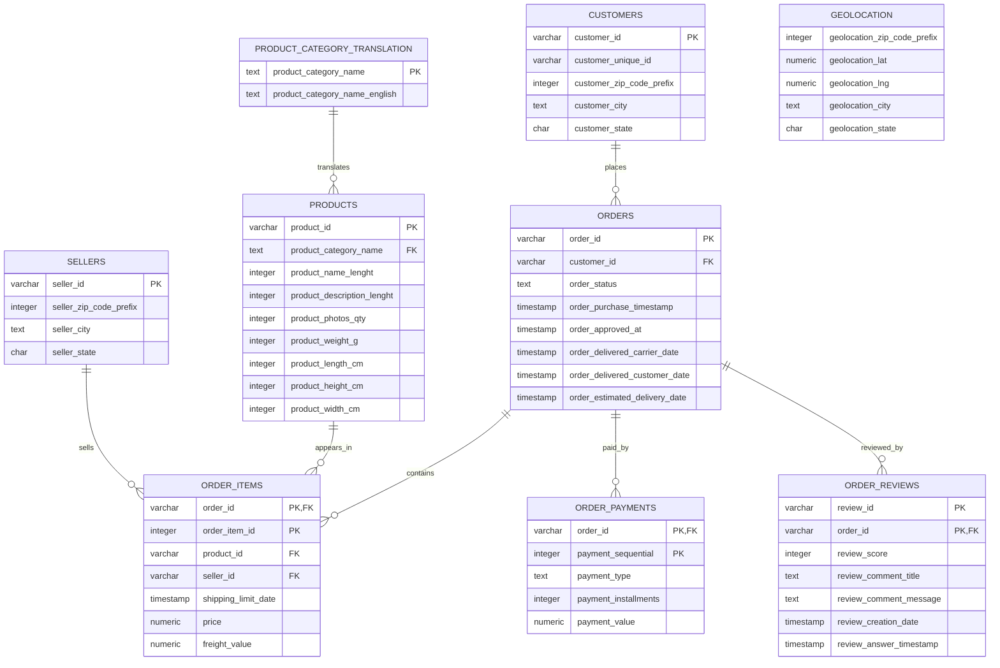

# ERD - Olist SQL Business Analysis

This ERD reflects the normalized source-style schema used for the SQL analysis.

## Modeling Notes

- `customers.customer_id` is order-level customer identity; `customer_unique_id` is the person-level identity used for repeat customer analysis.
- `order_items` is the main revenue fact table. One order can have multiple items and sellers.
- `order_payments` can contain multiple payment rows per order, so payment analysis is kept separate from item-revenue analysis to avoid duplicated joins.
- `geolocation` is included as source data but not joined by default because ZIP prefixes can repeat many times. Aggregate it to ZIP prefix first before using it in analysis.
